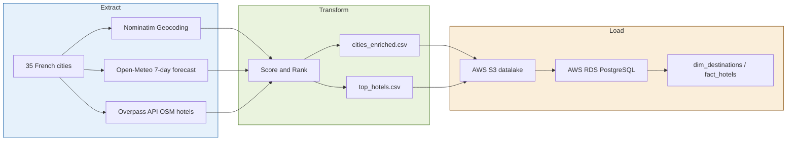

<div align="center">

# 🗺️ Kayak Destination Recommender

**End-to-end data engineering pipeline that ranks 35 French destinations in real-time using live weather & hotel data**

[](https://www.python.org/)
[](https://aws.amazon.com/)
[](https://open-meteo.com/)
[](https://openstreetmap.org/)
[](https://pytest.org/)
[](LICENSE)

</div>

---

## What this does

Pulls real-time data from three free APIs and answers: **"Which of 35 French cities should I visit this week?"**

The pipeline scores each destination by weather (temperature, rain, precipitation probability) and hotel quality (rating × stars, distance from city centre), ranks them, and optionally persists everything to **AWS S3 + RDS PostgreSQL**.

> No paid APIs. No scraping. Fully reproducible.

---

## Architecture



**Scoring formulas:**
```
weather_score = (avg_temp × 2.0) − (total_rain × 1.5) − (avg_precip_prob × 0.2)
hotel_score   = (star_rating × 10.0) − (distance_km × 2.0)
```

---

## Project structure

```
Kyak/
├── src/
│   └── kayak/
│       ├── config.py          # all constants and city list
│       ├── pipeline.py        # geocoding, weather, hotel collection
│       ├── scoring.py         # pure scoring + ranking functions
│       └── aws.py             # S3 upload + RDS load helpers
├── app/
│   └── streamlit_app.py       # interactive map dashboard
├── notebooks/
│   ├── 01-Plan_your_trip.ipynb  # project brief
│   └── 02-pipeline_demo.ipynb   # walkthrough, imports from src/
├── data/                      # sample CSV outputs
├── tests/
│   └── test_pipeline.py
├── .github/workflows/ci.yml   # pytest on every push
├── .env.example
├── pyproject.toml
└── README.md
```

---

## Quick start

```bash
# 1 — clone & enter
git clone https://github.com/<your-username>/Kyak.git
cd Kyak

# 2 — create virtual environment
python -m venv .venv
source .venv/bin/activate        # Linux / macOS
.venv\Scripts\activate           # Windows

# 3 — install dependencies
pip install -e ".[dev]"

# 4 — copy secrets template (AWS optional)
cp .env.example .env

# 5 — run the pipeline (local only, no AWS required)
python -m kayak.pipeline
```

---

## Running the Streamlit dashboard

```bash
streamlit run app/streamlit_app.py
```

Renders a live Plotly map of the top 5 destinations and a hotel comparison table.

---

## Running tests

```bash
pytest tests/ -v
```

All tests are pure-function unit tests — no API calls, no AWS account needed.

---

## Data sources

| Source | API | Usage | Auth |
|---|---|---|---|
| [Nominatim](https://nominatim.openstreetmap.org/) | REST | City geocoding | None (1 req/s limit) |
| [Open-Meteo](https://open-meteo.com/) | REST | 7-day weather forecast | None |
| [Overpass API](https://overpass-api.de/) | REST | Hotel POIs from OpenStreetMap | None |

---

## AWS setup (optional)

Only required if you want to persist data to S3 + RDS. Copy `.env.example` → `.env` and fill in:

| Variable | Description |
|---|---|
| `S3_BUCKET_NAME` | Name of your S3 bucket |
| `AWS_REGION` | e.g. `eu-west-3` |
| `RDS_HOST` | RDS PostgreSQL endpoint |
| `RDS_PORT` | `5432` (default) |
| `RDS_DB_NAME` | Database name |
| `RDS_USER` | DB username |
| `RDS_PASSWORD` | DB password |
| `RDS_SCHEMA` | Schema name (`public` by default) |

Then run:

```bash
python -m kayak.pipeline --s3 --rds
```

---

## Schema (RDS)

```sql
-- dim_destinations (one row per city)
city_id TEXT PRIMARY KEY,
city_name TEXT, country TEXT,
latitude FLOAT, longitude FLOAT,
avg_temp_7d FLOAT, total_rain_7d FLOAT,
weather_score FLOAT, destination_rank INT

-- fact_hotels (one row per hotel)
hotel_id TEXT PRIMARY KEY,
city_id TEXT REFERENCES dim_destinations(city_id),
hotel_name TEXT, hotel_latitude FLOAT, hotel_longitude FLOAT,
hotel_overall_rating FLOAT, distance_to_city_center_km FLOAT,
hotel_score FLOAT, hotel_rank INT
```

---

## Contributing

Pull requests welcome. Please run `pytest` and `ruff check src/` before opening a PR.

---

## License

MIT — see [LICENSE](LICENSE).
